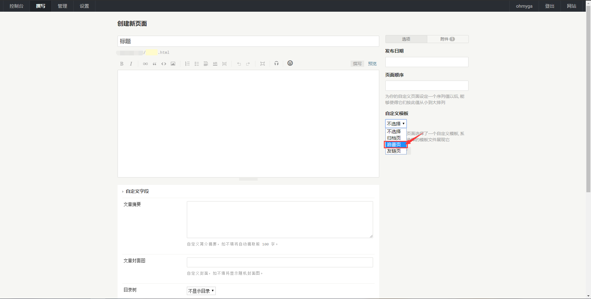

## 页面设置

- 首先新建一个独立页面 

- 选择自定义模板 `追番页` （移动端看不清图片的话，长按图片在新窗口打开即可。 

- 最后保存即可。

## 插件配置
- 首先下载 [Castle](https://github.com/ohmyga233/Castle-Plugin/releases/) 插件（否则无法正常使用。
- 安装插件 将插件解压到 `/usr/plugins/` 确保文件夹名字为 `Castle` 避免报错。

- 插件设置在 `后台->外观->外观设置->后台/插件设置->追番配置` 。 

- 如果选择 `BiliBili 源` 而且追番列表为 `仅自己可见` 时，需要填写 `Bilibili SESSDATA`（获取 `SESSDATA` 相见 [Issues-7#issuecomment-603803109](https://github.com/ohmyga233/castle-Typecho-Theme/issues/7#issuecomment-603803109)）。
- 如果选择 `Bangumi 源` 就不用填写 `SESSDATA`。